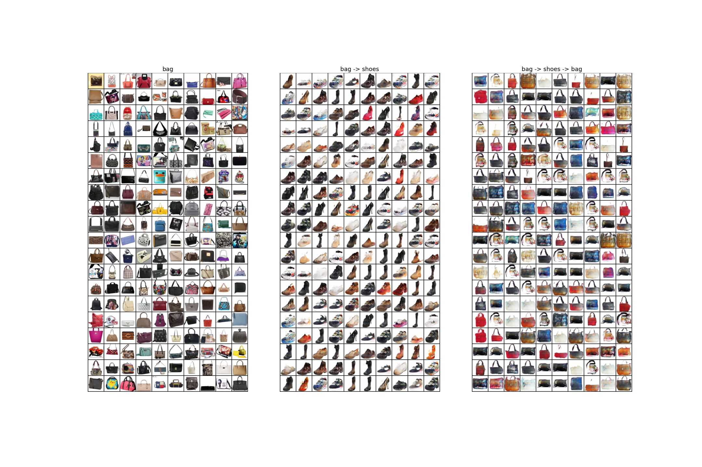
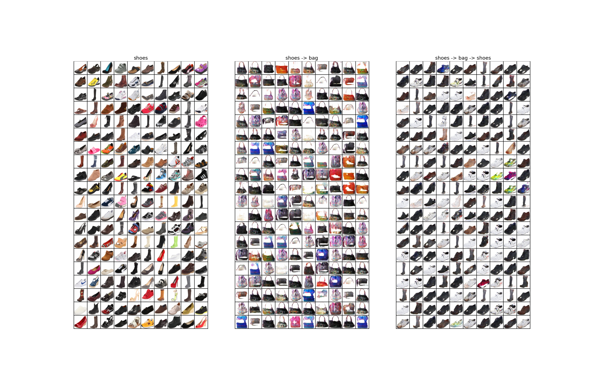
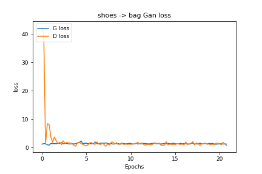
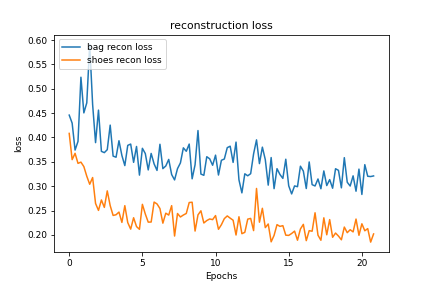

# DiscoGAN-pytorch

PyTorch implementation of [Learning to Discover Cross-Domain Relations with Generative Adversarial Networks](https://arxiv.org/abs/1703.05192).

## Results

### Shoes2handbags dataset

`x_A` -> `G_AB(x_A)` -> `G_BA(G_AB(x_A))` (shoes -> handbag -> shoes)

`x_B` -> `G_BA(x_B)` -> `G_AB(G_BA(x_B))` (handbag -> shoes -> handbag)

`Losses`

  
